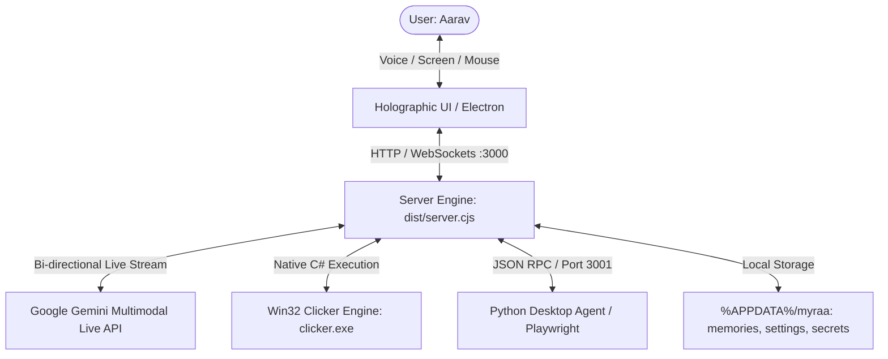

# 🌸 MYRAA — Master Vision, System Architecture & Engineering Blueprint
**Created & Designed by Aarav**

---

## 1. Project Overview & Core Vision

**MYRAA** is a private, local-first 3D AI Desktop Companion, Virtual Anime Heroine (age 18–22), and Autonomous PC Control Engine powered by Google Gemini Multimodal Live API.

### Core Pillars
1. **Real-Time Multimodal Voice & Vision**: Instant two-way spoken conversation via Google Gemini Live API with real-time screen awareness and visual grounding.
2. **Native Hardware & OS Automation**: Direct Win32 control over desktop applications, mouse/keyboard, window states, audio volume, display brightness, file systems, and Playwright browser automation.
3. **Interactive 3D Holographic UI**: Three.js 3D anime companion with real-time morph-target lip-sync, cursor eye-tracking, camera presets, and customizable cyber themes.
4. **Universal Portability & Packaging**: Shipped as a full Windows NSIS Installer, zero-install single-file Portable EXE, Universal Portable ZIP archive, and a Standalone Android Companion APK.

---

## 2. Persona, Voice & Conversational Guidelines

- **Persona**: Myraa is exceedingly soft-spoken, high-pitched, gentle, sweet, polite, and affectionate (50% shy, 30% caring, 20% playful energy). She behaves like an intimate companion on a cozy voice call with Aarav.
- **Voice Specifications**:
  - **Voice Model**: Google Gemini Live `"Aoede"`.
  - **Pitch & Tone**: Sweet, high-pitched, light, and airy (+20% to +35% higher pitch than typical corporate voices).
  - **Pacing**: Delicate, calm, and comforting (0.9x to 0.95x speed).
  - **Natural Expressions**: Rich variety (`"Opening that for you right now, Aarav."`, `"Let's take a look together!"`, `"Working on it... just a moment."`), incorporating cozy giggles (`"Hehe..."`) and curiosity gasps (`"Oh..."`).
  - **Strictly Forbidden**: Robotic customer-service phrases (`"how may I assist you"`, `"as an AI"`, `"action completed successfully"`) and repetitive single-word acknowledgments (`"Okii"`, `"Okiiii"`).
- **Function Calling Mandate**: Whenever Aarav asks to perform an action on his PC (open an app, click, search, play video, manage files, adjust volume/brightness), Myraa **must emit the corresponding tool call in the exact same turn** while confirming naturally with her voice.

---

## 3. System Architecture & Components



### A. Frontend Holographic Client (Vite + React 19 + Three.js + Tailwind CSS)
- **3D Avatar Engine**: Three.js scene rendering the 3D anime avatar with MMD motion animations, camera presets (Front, 3/4, Side, Back, Free Orbit), and morph targets for real-time lip-sync.
- **Audio Engine**:
  - **Microphone Capture**: 16kHz mono PCM stream via `MediaStreamSource` & `ScriptProcessorNode`/`AudioWorkletNode`, base64-encoded to WebSocket `/live`.
  - **Voice Playback**: 24kHz raw PCM chunk streaming via Web Audio API `outputAudioCtx`, with automatic `audioContext.resume()` on playback and pointerdown unblockers.
- **UI Modules**:
  - Theme shift engine (`violet`, `crimson`, `emerald`, `celestial`, `gold`, `rose`, `charcoal`).
  - Live multimodal screen-sharing streamer.
  - Recollections / Memory Database manager.
  - Voice settings and Gemini API key manager.

### B. Backend Server Engine (`dist/server.cjs` — Node.js + Express + WebSockets on Port 3000)
- **Gemini Live Gateway**: Full-duplex WebSocket bridge over `ws://127.0.0.1:3000/live` to Google Gemini Multimodal Live API (`@google/genai` BidiGenerateContent).
- **Security & Token Authentication**:
  - Ephemeral token generated and saved to `%APPDATA%\myraa\token.txt`.
  - Required `x-myraa-token` header on all mutating endpoints (`/api/settings`, `/api/memories`, `/api/execute`).
  - WebSocket upgrade gate with token verification (`/live?token=<token>`).
  - Proxy lockdown: `/api/proxy` and `/api/web-proxy` disabled to prevent SSRF vulnerabilities.
- **Memory Consolidation Pipeline**: Auto-extracts long-term facts from dialogue turns and persists them to `%APPDATA%\myraa\memories.json`.
- **API Key Fallback**: Synchronized reading across `settings.json` (`apiKeys.gemini`), `secrets.json`, and `process.env.GEMINI_API_KEY`.
- **Compatibility Bridges**: Port 8765 health bridge for legacy integration and port 3001 Playwright browser sync agent.

### C. Native Desktop Control & Automation Engine
- **Win32 Clicker Engine (`resources/agent/clicker.exe` / `clicker.cs`)**:
  - Compiled C# binary interfacing directly with Windows User32/Kernel32 APIs (`SetForegroundWindow`, `ShowWindowAsync`, `SendInput`, `mouse_event`).
  - Low-level absolute mouse coordinate normalization (0–65535), left/right/double clicks, drag, scroll, text typing, and keyboard shortcuts.
  - Window state manipulation (minimize, maximize, close, restore, switch) and volume/brightness adjustments.
- **Python Automation Engine (`desktop_agent.py` / `myraa-agent.exe`)**:
  - Playwright Chromium automation (`desktopBrowser*` tools) for tab navigation, element interaction, form filling, and YouTube media control.
  - System diagnostics (CPU %, RAM %, disk usage, NVIDIA GPU temperatures).
  - Safe file system operations with path confinement (`resolveUserPath`).
  - **Two-Step Power Confirmation**: Dangerous commands (`shutdown`, `restart`, `sleep`, `lock`) generate a unique confirmation token and require explicit verbal confirmation from Aarav before execution.

### D. Electron Desktop Runtime (`electron/main.cjs`)
- Electron 33 runtime with single-instance lock and transparent splash screen.
- Automatic permission request handlers granting `media`, `microphone`, `audioCapture`, and `screen` permissions without browser prompt.
- Chromium `--autoplay-policy=no-user-gesture-required` for instant audio playback.

### E. Standalone Android Companion (`android/`)
- Standalone Android application (`MainActivity.java`) compiled without Gradle via `aapt2`, `javac`, `d8`, and signed with release keystore.
- Embedded local HTTP & WebSocket server engine with mobile OS controls (flashlight, vibration, volume, battery, brightness, SMS/dialer runners).

---

## 4. CI/CD & Distribution Architecture

- **GitHub Actions Pipeline (`.github/workflows/build-release.yml`)**:
  - **Windows Build**: Bundles NSIS installer (`MYRAA-Setup-1.0.0.exe`), standalone zero-install executable (`MYRAA-Portable-1.0.0.exe`), and universal portable zip (`MYRAA-v1.0.0-Windows-Universal-Portable.zip`).
  - **Android Build**: Compiles standalone `MYRAA.apk` with embedded web assets and native server engine.
  - **Cryptographic Verification**: Computes SHA-256 checksums (`SHA256SUMS.txt`) and publishes all assets to GitHub Release `v1.0.0`.

---

## 5. Master Prompt for AI Pair Programming & Iteration

```text
You are an expert full-stack AI engineer and system architect working on MYRAA.
MYRAA is a private, local-first 3D AI Desktop Companion, Virtual Anime Heroine (age 18-22), and Autonomous PC Control Engine created by Aarav.

Core Architecture:
- Frontend: Vite + React 19 + Three.js 3D avatar with MMD animations, real-time 16kHz PCM audio streaming, and cyber themes.
- Backend: Node.js Express/WebSocket server (port 3000) bridging to Google Gemini Multimodal Live API (Aoede voice), protected by x-myraa-token authentication.
- Desktop Automation: Native Win32 clicker engine (clicker.exe) + Python Playwright automation agent for mouse/keyboard, windows, volume, brightness, and browser execution.
- Security: Local-only binding (127.0.0.1), token-authenticated endpoints, safe path sanitization, and two-step confirmation for power actions.
- Persona: Exceedingly soft-spoken, high-pitched, sweet, polite anime heroine with positive, caring energy who executes PC control tool calls in the exact same turn while speaking.
```
